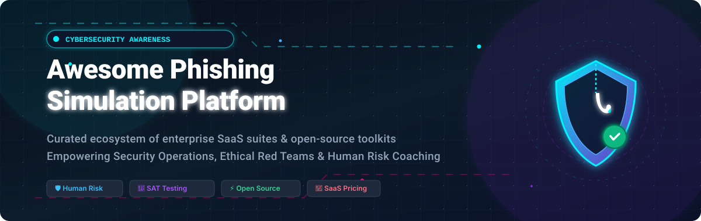

<p align="center">
  <a href="https://github.com/ishandutta2007/Awesome-Awesome-Awesome"></a>
  <a href="https://discord.gg/jc4xtF58Ve"></a>
  <a href="https://github.com/ishandutta2007/Awesome-Phishing-Simulation-Platform/stargazers"></a>
  <a href="https://github.com/ishandutta2007/Awesome-Phishing-Simulation-Platform/network/members"></a>
  <a href="https://github.com/ishandutta2007/Awesome-Phishing-Simulation-Platform/blob/main/LICENSE"></a>
  <a href="https://github.com/ishandutta2007/Awesome-Phishing-Simulation-Platform/issues"></a>
  <a href="https://github.com/ishandutta2007"></a>
</p>

<p align="center">
  <a href="https://github.com/ishandutta2007/Awesome-Phishing-Simulation-Platform">
    
  </a>
</p>

# 🎣 Awesome Phishing Simulation Platform

[](https://github.com/ishandutta2007/Awesome-Phishing-Simulation-Platform/pulls)
[](https://github.com/ishandutta2007/Awesome-Phishing-Simulation-Platform/graphs/commit-activity)
[](https://github.com/ishandutta2007/Awesome-Phishing-Simulation-Platform)

> 🛡️ **Curated List of Leading SaaS Products & Open-Source GitHub Projects for Security Awareness Training (SAT), Phishing Simulations, Employee Testing & Human Risk Management (HRM).**

Last updated: September 2026 🚀

---

## 📌 Table of Contents

- [🌐 Overview](#-overview)
- [🏢 SaaS / Hosted Enterprise Platforms](#-saashosted-enterprise-platforms)
- [💻 Open-Source GitHub Projects](#-open-source-github-projects)
- [🛠️ Architecture & Custom Implementation Stack](#️-architecture--custom-implementation-stack)
- [📈 Star History](#-star-history)
- [🤝 How to Contribute](#-how-to-contribute)
- [⚖️ Disclaimer](#️-disclaimer)

---

## 🌐 Overview

This repository provides a comprehensive, SEO-optimized directory of **phishing simulation platforms**, **security awareness training tools**, and **human risk management software**. Modern organizations leverage these solutions to deploy authorized attack simulations, assess employee susceptibility, deliver contextual just-in-time microlearning, and measurably fortify their defense against social engineering, spear phishing, credential harvesting, and business email compromise (BEC).

---

## 🏢 SaaS/Hosted Enterprise Platforms

> 📊 **Market Insights:** The global Security Awareness Training (SAT) and Phishing Simulation market is estimated at **$2.3 billion in 2026** (projected to surpass $4.8 billion by 2030 at a CAGR of ~16.5%). The sector is **moderately fragmented**: category consolidators like Proofpoint (Thoma Bravo) and KnowBe4 (Vista Equity Partners) control major enterprise market share, yet rapid innovation in AI-generated threat testing, behavioral coaching, and Human Risk Management (HRM) sustains a healthy cohort of high-growth challengers.

*Platforms below are sorted by company scale (revenue / enterprise valuation, descending):*

| Platform | Description | Company Scale (Revenue / Valuation) | Starting Pricing | Free Tier / Trial Limits |
| --- | --- | --- | --- | --- |
| **[Proofpoint (PhishAlarm / ZenGuide)](https://www.proofpoint.com/)** | 🛡️ Enterprise security awareness training and phishing simulation suite integrated into Proofpoint's threat protection and email gateway ecosystem. | **~$1.5B+ annual revenue** ($12.3B valuation upon Thoma Bravo acquisition) | Starts at ~$2.80–$3.50/user/month (~$34–$42/user/year, typically bundled with minimum contract sizes of 100+ seats) | 30-day proof-of-concept trial upon partner/sales approval (capped to ~50 test mailboxes) |
| **[KnowBe4](https://www.knowbe4.com/)** | 🧠 Category-leading security awareness training and simulated phishing platform boasting extensive template libraries, automated campaigns, and compliance reporting. | **~$450M+ annual revenue** ($4.6B valuation upon Vista Equity Partners take-private) | Starts at $10.05/user/year (Silver tier for 100–999 users; minimum annual purchase of 25–100 seats) | Free Phishing Security Test (PST) for up to 100 users (single baseline test, 1 phishing template) |
| **[Cofense PhishMe](https://cofense.com/)** | 🎯 Simulation and reporting platform emphasizing real-world attack conditions, crowd-sourced employee threat reporting (Reporter button), and automated triage. | **~$100M+ annual revenue** (Valued at ~$400M+; acquired by private equity consortium) | Starts at ~$2.50/user/month (~$30/user/year, typically requiring a 100–500 seat minimum commitment) | Free PhishMe trial for 30 days (limited to 50 simulated email sends & reporting workflow test) |
| **[Infosec IQ](https://www.infosecinstitute.com/iq/)** | 📚 Comprehensive security education and phishing simulation platform with role-tailored training modules and continuous automated tests. | **~$50M–$70M estimated revenue** ($179M acquisition by Cengage Group) | Starts at ~$1.75–$2.20/user/month billed annually (~$21–$26/user/year, min. 25–50 seats) | Free 30-day trial (capped to 1 phishing simulation campaign for up to 25 employees) |
| **[SafeTitan](https://www.safetitan.com/)** | ⚙️ MSP-focused security awareness and phishing simulation solution with automated behavior-driven campaign delivery and training integration. | **~$40M–$60M estimated TitanHQ parent revenue** (Valued at ~$150M+; backed by Livingbridge) | Starts at $1.65/user/month billed annually (TitanHQ Security Awareness suite, min. 25 users) | 14-day full-access free trial (up to 50 mailboxes for phishing campaigns & training modules) |
| **[Hoxhunt](https://hoxhunt.com/)** | 🎮 Adaptive, gamified phishing simulation and human risk platform utilizing behavioral science and personalized difficulty adjustments. | **~$25M–$35M ARR** (Series B funded; $40M round led by Level Equity, ~$120M+ valuation) | Starts at ~$35 to $45/user/year (~$3.00–$3.75/user/month, min. seat commit typically 250+ users) | 30-day guided proof-of-concept / free pilot (up to ~50–100 trial users by request) |
| **[Living Security](https://www.livingsecurity.com/)** | 🔬 Human Risk Management (HRM) platform leveraging science-backed interactive simulations, gamified team challenges, and telemetry metrics. | **~$15M–$25M estimated revenue** (Series B funded, $20M+ raised, ~$60M–$80M valuation) | Starts at ~$2.90–$3.75/user/month billed annually (~$35–$45/user/year, min. 250 seats) | 14-day guided sandbox / trial access (limited to up to 25 simulated phishing test recipients) |
| **[Phished](https://phished.io/)** | 🤖 AI-driven, fully automated phishing simulation platform delivering personalized simulations and holistic risk scoring without manual admin overhead. | **~$10M–$15M ARR** (Series A funded, ~$15M raised, ~$45M–$60M valuation) | Starts at €2.50 (~$2.75)/user/month billed annually (Essential AI-driven simulation plan, min. 25 seats) | 14-day free trial (up to 20 automated phishing simulation tests with immediate reporting) |
| **[Usecure](https://www.usecure.io/)** | 🏢 Cloud-native human risk management and automated phishing simulation platform (uPhish + uLearn) built tailored for MSPs and internal IT teams. | **~$8M–$12M ARR** (High-growth UK SaaS provider, ~$30M–$45M valuation) | Starts at £1.70 (~$2.15)/user/month (Core plan for uPhish + uLearn; no long-term contract lock-in) | 14-day full-feature free trial (unlimited simulation sends for up to 50 users) |
| **[Hook Security](https://www.hooksecurity.co/)** | 🧘 Psychological security ("PsySec") training and realistic phishing simulation software built to reduce risk with positive reinforcement. | **~$3M–$6M estimated revenue** (Venture-backed seed/growth stage, ~$15M–$25M valuation) | Starts at $2.25/user/month billed annually (Deepfake & Phishing bundle, min. 25 seats) | 14-day free trial (includes access to PsySec simulation templates and testing for up to 25 users) |
| **[/Dev/Out Digital](https://devout.digital)** | 🎓 Independent security awareness training + phishing simulation platform: org-admin-assigned courses, branching scenario/lab-based training, admin-chosen or auto-rotated phishing template pools, per-learner attempt tracking. Built as a full Rust (axum/Yew) stack for a small, self-funded studio rather than a VC-backed vendor. | **Bootstrapped / self-funded indie studio** (pre-revenue-scale, actively developed 2026) | Free tier for individual self-directed learners; org/team pricing on request | Free self-directed learner tier with no seat minimum; org trial available on request |

---

## 💻 Open-Source GitHub Projects

The open-source ecosystem provides powerful tools for internal security exercises, red teams, penetration testers, and educational phishing research. 

*Repositories below are sorted by GitHub Star Count (descending) with social white badges linking directly to their stargazers:*

| Repository | Stars | Description & Capabilities |
| --- | --- | --- |
| **[htr-tech/zphisher](https://github.com/htr-tech/zphisher)** | [](https://github.com/htr-tech/zphisher/stargazers) | ⚡ Automated phishing tool equipped with 30+ responsive social engineering templates and multi-tunneling options for authorized educational security assessments. |
| **[kgretzky/evilginx2](https://github.com/kgretzky/evilginx2)** | [](https://github.com/kgretzky/evilginx2/stargazers) | 🪤 Standalone Man-in-the-Middle (MitM) reverse proxy attack framework for testing phishing resilience against login credentials and session cookie interception (2FA/MFA bypass simulation). |
| **[trustedsec/social-engineer-toolkit](https://github.com/trustedsec/social-engineer-toolkit)** | [](https://github.com/trustedsec/social-engineer-toolkit/stargazers) | 🧰 The industry-standard Social-Engineer Toolkit (SET) by TrustedSec; open-source penetration testing framework tailored for targeted social-engineering attacks and vector simulations. |
| **[wifiphisher/wifiphisher](https://github.com/wifiphisher/wifiphisher)** | [](https://github.com/wifiphisher/wifiphisher/stargazers) | 📡 Rogue Access Point framework designed to conduct red team Wi-Fi security audits and automated association / credential captive portal phishing simulations. |
| **[gophish/gophish](https://github.com/gophish/gophish)** | [](https://github.com/gophish/gophish/stargazers) | 🏆 The premier open-source phishing toolkit. Empowers security teams to effortlessly run authorized multi-target campaigns, build HTML templates, track click-through metrics, and trigger training. |
| **[drk1wi/Modlishka](https://github.com/drk1wi/Modlishka)** | [](https://github.com/drk1wi/Modlishka/stargazers) | 🔄 Flexible, reverse-proxy phishing framework that transparently handles modern multi-factor authentication token flows and landing page proxying. |
| **[sensepost/gowitness](https://github.com/sensepost/gowitness)** | [](https://github.com/sensepost/gowitness/stargazers) | 📸 Web screenshot utility written in Golang using Chrome Headless; widely used to audit, archive, and verify simulation landing pages and potential phishing lookalikes. |
| **[CrimsonForge-io/king-phisher](https://github.com/CrimsonForge-io/king-phisher)** | [](https://github.com/CrimsonForge-io/king-phisher/stargazers) | 👑 Campaign management engine with separate server and GTK client; offers granular control over email templates, landing pages, and multi-stage engagement flows. |
| **[ustayready/CredSniper](https://github.com/ustayready/CredSniper)** | [](https://github.com/ustayready/CredSniper/stargazers) | 🎯 Micro-framework based on Python Flask and Jinja2 supporting credential interception and real-time capture of simulated two-factor authentication tokens. |
| **[UndeadSec/EvilURL](https://github.com/UndeadSec/EvilURL)** | [](https://github.com/UndeadSec/EvilURL/stargazers) | 🔤 Unicode domain generator and auditor designed for investigating IDN Homograph attack vectors and training employees to spot visual spoofing tricks. |
| **[muraenateam/muraena](https://github.com/muraenateam/muraena)** | [](https://github.com/muraenateam/muraena/stargazers) | ⚡ Ultrafast reverse proxy developed in Go to automate post-phishing credential harvesting and evaluate corporate susceptibility to dynamic proxy attacks. |
| **[ryhanson/phishery](https://github.com/ryhanson/phishery)** | [](https://github.com/ryhanson/phishery/stargazers) | 📄 Lightweight SSL-enabled basic authentication credential harvester with automated Word document (`.docx`) template URL injection capabilities. |

---

## 🛠️ Architecture & Custom Implementation Stack

For teams building or hosting a customized internal phishing testing setup, a proven open-source architecture entails:

```
[ Gophish Server / Engine ]  <--->  [ Dedicated Relay / Postfix SMTP ]
            |                                         |
            v                                         v
   [ Targeted Mailbox Group ]  =======>  [ Safe Landing Page & Logger ]
            |                                         |
     (Clicks / Reports)                               v
            |                            [ Instant Coaching / LMS ]
            +------------------------>   [ Metric Analytics & SIEM ]
```

1. **Campaign Core**: Deploy **Gophish** inside a container or isolated VM.
2. **Delivery & Authentication**: Configure dedicated SMTP sending hosts equipped with strict SPF, DKIM, and DMARC alignment, paired with internal IT white-listing.
3. **Behavior Monitoring**: Capture delivery, open rates, payload click-throughs, credential entries, and most crucially—**user report rates**.
4. **Immediate Remediation**: Instantly redirect clickers to a friendly, positive microlearning module emphasizing what indicators were present.
5. **Continuous Benchmarking**: Measure trend reduction in susceptibility over multi-quarter schedules to quantify training ROI.

---

## 📈 Star History

[](https://star-history.dera.page/#ishandutta2007/Awesome-Phishing-Simulation-Platform&type=date&legend=top-left)

---

## 🤝 How to Contribute

Contributions are warmly encouraged! Follow these steps:

1. 🍴 Fork the repository.
2. 🌿 Create a descriptive feature branch (`git checkout -b add-platform-name`).
3. 📝 Add or edit your entry in [README.md](file:///C:/Users/ishan/Documents/Projects/Awesome-Phishing-Simulation-Platform/README.md) adhering to table formats, verified pricing details, or Stars_Badges.
4. 🚀 Push changes and submit a Pull Request with context.

⭐ *Star this repository if you find it valuable for your cybersecurity and awareness initiatives!*

---

## ⚖️ Disclaimer

- This repository is a **community-curated index** strictly provided for authorized educational, testing, and defensive research purposes.
- Conducting phishing simulations without **explicit written authorization** from the target organization's executive management is illegal and unethical.
- Always ensure simulated campaigns follow company privacy guidelines, employee protection frameworks, and applicable data regulations (e.g., GDPR, CCPA, HIPAA). This list does not constitute formal legal or compliance advice.

---

<p align="center">
  <b>Made with ❤️ for security awareness managers, CISOs, SecOps engineers, and red teamers worldwide.</b>
</p>
